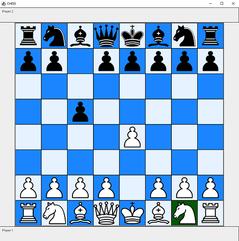

# Chess GUI in Java
## Author: Joe Buckley

All work and code my own. Created 12 June 2017, last updated 13 January 2021.
Originally developed using Java 8(?), succesfully compiled and run on openjdk version 15.0.1.

An IDE is recommended to build and run the program, but manual compilation works too.
Make sure to have java binaries in your machine's path variable, navigate to `ChessGUI` directory, and run:

```
$ javac -d bin src/chess/*.java
$ java -cp bin chess.Board
```

The first line will compile the program and the second will run the main method of the `Board` class,
launching an instance of the GUI for you to use!



Old Notes:

code found in src/chess
images in piece_images
main method in Board class

+ first uploaded draft of chess GUI
+ need more efficiency in paint methods -- takes too long to load
	- has been improved on but can still use more work, 
	  especially w respect to image sizes
+ GUI does not yet work the way it should:
	- framework is there
	- must make each SquarePanel a MouseListener and 
	  connect 8x8 SquarePanel array to array of pieces 
	  (also 8x8, initially with 16 non-null Piece objects) so pieces can move
+ working on sizing GUI to appropriate size of screens
	- using Toolkit to get user's screen dimension
	- working from there using GridBagLayout to improve functionality and appearance
	- possibly implement a few different standard sizes based on different
	  standard screen sizes to avoid having to resize piece images
